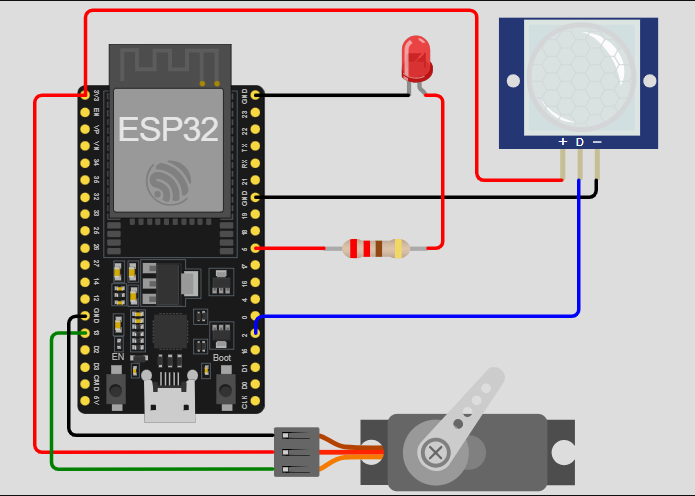
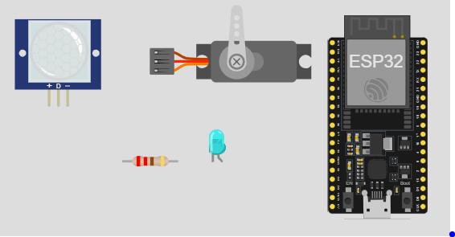
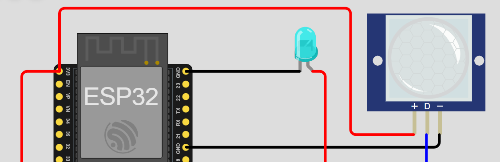

# Alimentador_de_gatos_TEC_2025

Comedero autómatico para gatos - Jose Miguel Mora Herrera

## Descripción
Este proyecto implementa un comedero inteligente que dispensa alimento solo cuando detecta la presencia del gato mediante un sensor PIR, controlando un servomotor y un LED indicador. Está basado en un ESP32 y simulado en Wokwi.

## Funcionamiento
- Detecta movimiento con sensor PIR.
- Activa el servomotor para abrir la compuerta y servir comida.
- Enciende un LED mientras dispensa.
- Evita dispensar repetidamente si el gato permanece frente al plato.

## Lista de Materiales
Consulta el archivo en la carpeta `bom/`:
- [BOM.xlsx](bom/BOM.xlsx)

### Tabla de Materiales (Vista rápida)
| Cantidad | Componente        | Modelo       | Comentarios                         |
|----------|-------------------|-------------|------------------------------------- |
| 1        | Microcontrolador  | ESP32 Devkit| Control principal del sistema        |
| 1        | Sensor PIR        | HC-SR501    | Detecta movimiento del gato          |
| 1        | Servomotor        | Servo       | Acciona la compuerta del comedero    |
| 1        | LED + Resistencia | 220 Ω       | Indicador visual durante dispensación|
| Varios   | Cables            | ------------| Conexiones entre componentes         |

## Diagrama y Conexiones

| Componente           | Pin de Señal                      | Conexión al ESP32        |
|----------------------|-----------------------------------|--------------------------|
| **Sensor PIR (Salida)** | Pin S                          | **GPIO 2**               |
| **Servomotor (Señal)**  | Pin SIG                        | **GPIO 13**              |
| **LED (Ánodo/Positivo)**| Resistencia (220 Ω)            | **GPIO 5**               |
| **Alimentación**        | VCC de todos los módulos       | Pin **3V3** del ESP3     |
| **Tierra**              | GND de todos los módulos       | Pin **GND** del ESP32    |  

## Código
El código fuente está en la carpeta `firmware/`:
- `sketch.ino` → Programa principal para ESP32.
  
## Fotos del Proyecto
-Imagen de los componentes usados en Wokwi
 
----------------------------------------------------

## Video de Funcionamiento

## Cómo usar
1. Conecta el hardware según el diagrama.
2. Carga el código en el ESP32.
3. Simula en Wokwi o prueba físicamente.
4. Verifica el funcionamiento con el sensor PIR y el servomotor.
